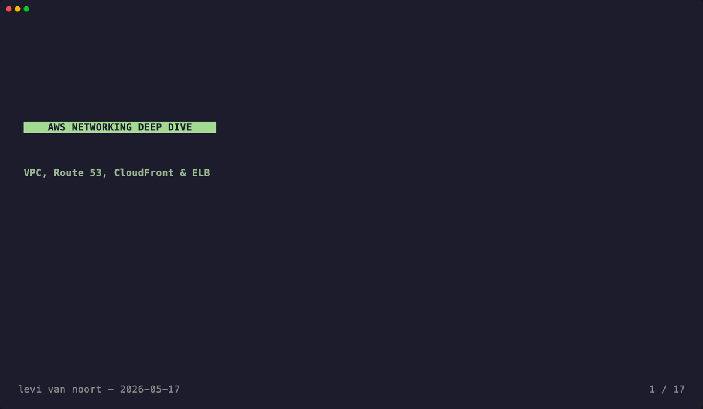
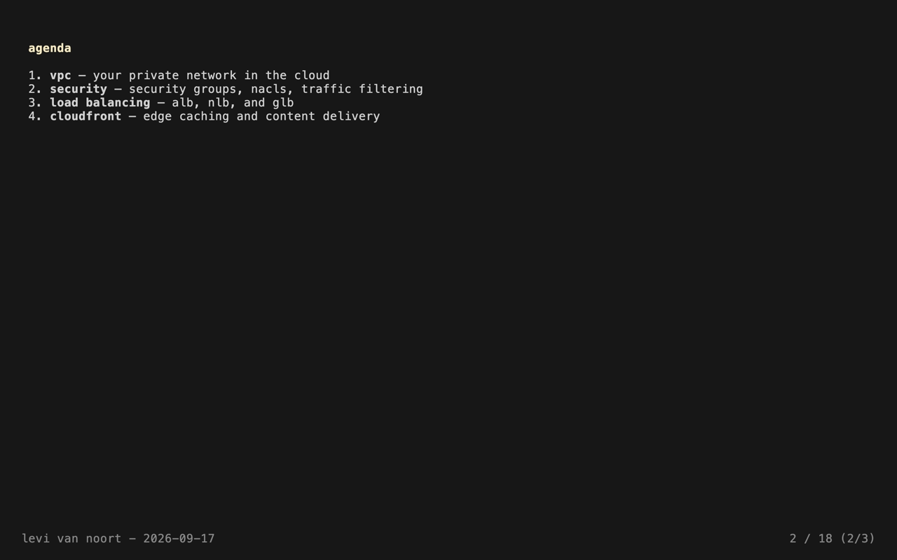
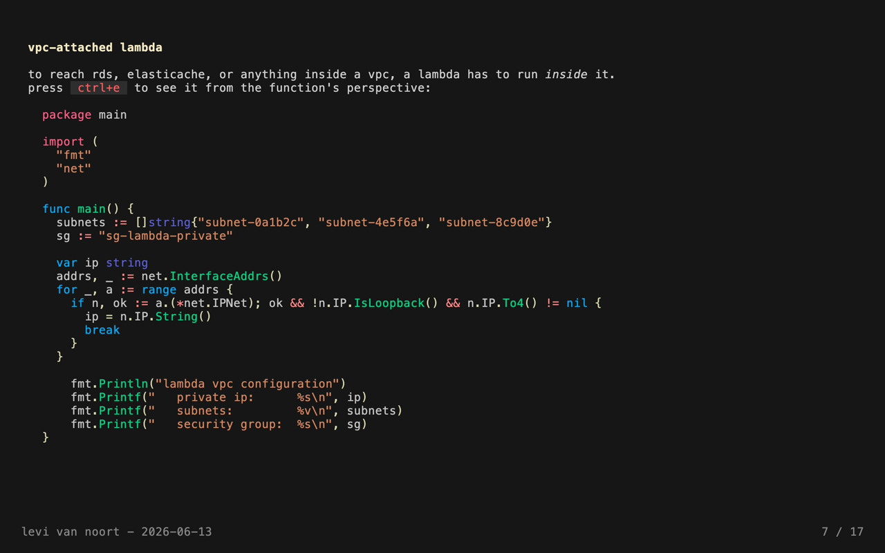
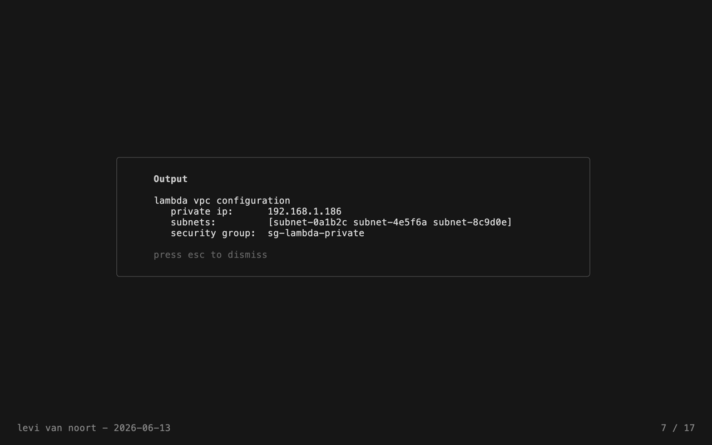
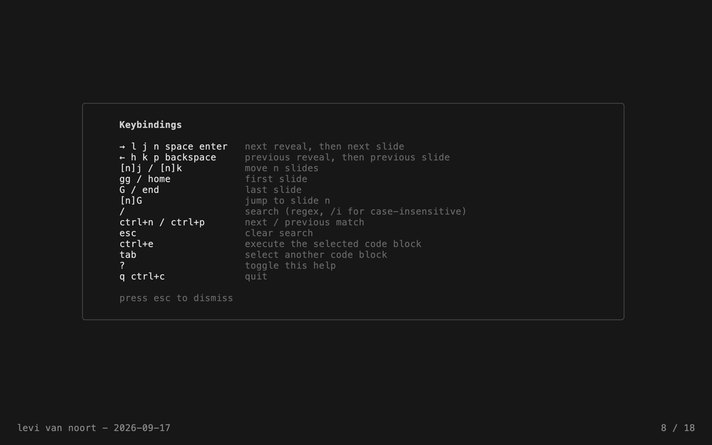

<p align="center">
  <a href="https://kontrolplane.dev">
    
  </a>
</p>

`lekture` is a terminal user interface (tui) application designed for presenting markdown-based slideshows. It provides an intuitive and efficient way to create and deliver presentations directly from the terminal. With Lekture, you can render markdown with full formatting, display inline images, reveal a slide in stages, execute code blocks, serve presentations over SSH, and export a deck to a self-contained html file, making it an essential tool for engineers who prefer working within a terminal environment.

## installation

```bash
go install github.com/kontrolplane/lekture@latest
```

requires [go](https://go.dev/) 1.26 or later. alternatively, clone the repository and run `make build`.

## usage

```bash
lekture <presentation.md>
```

```bash
lekture serve <presentation.md> [--port PORT] [--host HOST] [--allow-exec]
```

```bash
lekture dump <presentation.md> [--width N]
```

```bash
lekture export <presentation.md> [--output deck.html]
```

```bash
cat presentation.md | lekture
```

read from stdin explicitly with `-`:

```bash
cat presentation.md | lekture -
```

`lekture --help` prints usage, `lekture --version` prints the build version.

`lekture dump` renders every slide to stdout with formatting intact, instead of starting the interactive ui. it makes a deck pipeable and diffable:

```bash
lekture dump presentation.md | less -R
lekture dump presentation.md --width 100 > deck.txt
```

`lekture export` writes a self-contained html document — no external stylesheets, scripts, fonts, or images, with pictures embedded and code syntax-highlighted — for sharing a deck with people who will not run a terminal:

```bash
lekture export presentation.md --output deck.html
```

arrow keys navigate the exported page, and printing it gives one slide per page. reveals are flattened in the export, since an exported deck is read rather than presented, and raw html in a presentation is escaped rather than rendered.

the deck reloads automatically when the file changes on disk, including when your editor saves by writing a temporary file and renaming it over the original.

slides are separated by a line containing only `---`. a `---` inside a fenced code block is content, not a separator, so a slide can show yaml or markdown samples safely. note that `---` directly beneath a line of text is still treated as a slide separator rather than a setext heading underline.

## frontmatter

optional yaml frontmatter at the top of the file configures the deck:

```yaml
---
author: levi van noort
date: YYYY-MM-dd
paging: "%d / %d"
theme: kontrolplane
align: top-left
headingColor: "#F4E8C1"
---
```

| field | default | description |
| --- | --- | --- |
| `author` | — | shown at the left of the status bar |
| `date` | — | shown next to the author; supports `YYYY`, `YY`, `MMMM`, `MMM`, `MM`, `dd`, `d` |
| `paging` | `Slide %d / %d` | status bar format; must contain exactly two `%d` verbs |
| `theme` | — | built-in name, file path, or `http(s)` url |
| `align` | `top-left` | `top-left` or `center` |
| `headingColor` | `#a6da95` | hex color driving the heading palette |

invalid values fall back to their defaults rather than rendering as garbage.

## incremental reveals

a slide can be revealed in stages. put `<!-- pause -->` on a line of its own and everything after it stays hidden until you press forward again:

```markdown
## findings

- latency dropped 40%

<!-- pause -->

- error rate unchanged

<!-- pause -->

- cost fell by a third
```

the status bar shows the reveal position, e.g. `3 / 17 (2/3)`. the marker is invisible to every markdown renderer, and a `<!-- pause -->` inside a fenced code block is treated as content, so you can show one on a slide.

moving forward walks the reveals, then moves to the next slide. moving backward walks them in reverse, and stepping back into a previous slide lands on its *last* reveal rather than hiding what the audience already saw. counted motions (`5j`), `gg`, `G`, `home`, `end` and search jump between slides and start from the first reveal.

## configuration

per-presentation frontmatter covers one deck. to set your own defaults for every deck, create `~/.config/lekture/config.yaml` (or `$XDG_CONFIG_HOME/lekture/config.yaml`):

```yaml
author: levi van noort
theme: kontrolplane
align: center
headingColor: "#F4E8C1"
```

it takes the same fields as frontmatter. precedence runs built-in defaults < config file < frontmatter, so a presentation always wins over your defaults. a missing config file is not an error; an unknown key is, so a typo is reported rather than ignored. a relative `theme` path in the config resolves against the config file's own directory, so a house theme kept beside it works from any deck.

## themes

by default `lekture` renders with the classic glamour dark palette. set `theme` in a presentation's frontmatter to override it:

```yaml
---
theme: kontrolplane
---
```

two themes are bundled and are embedded in the binary, so they resolve by bare name from any directory: `default` (the built-in classic look) and `kontrolplane` — navy ink, cream paper, and a goldenrod accent. a value containing a path separator is treated as a file path resolved relative to the presentation file, and `http(s)` urls are fetched (capped at 1 mib). heading color can be tuned independently via `headingColor` (defaults to `#a6da95`; pair the kontrolplane theme with `headingColor: "#F4E8C1"`). if a theme fails to load, the default is used and the reason is shown in the status bar.

## serving over ssh

```bash
lekture serve presentation.md --port 53531 --host localhost
```

defaults are `--host localhost` and `--port 53531`. the host key is stored under your user config directory so connecting clients see a stable host identity.

editing the presentation while serving pushes the new slides to everyone already connected — no restart, no dropped viewers.

connections are **not authenticated**. code execution is therefore disabled for served sessions unless `--allow-exec` is passed — without that gate, anyone who can reach the port could run the deck's code blocks on the presenting machine. keep the default `localhost` bind unless you intend the deck to be reachable from the network.

## terminals

`lekture` adapts to the terminal's color support: truecolor, 256-color, and 16-color terminals each get an appropriate rendering, and [`NO_COLOR`](https://no-color.org/) is honored. where color is unavailable, inline images are replaced by their alt text rather than a screenful of block characters.

## demonstration

`slide overview`
<p align="center">
  
</p>

`revealing a slide in stages`
<p align="center">
  
</p>

`code blocks with syntax highlighting`
<p align="center">
  
</p>

`code execution`
<p align="center">
  
</p>

`built-in keymap (press ?)`
<p align="center">
  
</p>

## development

- [go](https://go.dev/) 1.26+

```bash
make build && ./lekture example/presentation.md
```

`make check` runs the same checks as ci (format, vet, tests with the race detector, build).

the readme's gif and screenshots are generated from the tapes in `vhs/`:

```bash
make assets
```

this needs [vhs](https://github.com/charmbracelet/vhs). note that **vhs 0.12.0 is broken** — it runs a tape, exits 0 and writes no file ([vhs#787](https://github.com/charmbracelet/vhs/issues/787)) — so pin a working release:

```bash
go install github.com/charmbracelet/vhs@v0.11.0
```

`make assets` refuses to run against 0.12.0 rather than appearing to succeed.

## keybindings

press `?` inside the presentation for this list.

- `q`, `ctrl+c`: quit
- `esc`: clear an active search, otherwise quit
- `→`, `l`, `j`, `n`, `space`, `enter`, `down`, `pgdown`: next reveal, then next slide
- `←`, `h`, `k`, `p`, `backspace`, `up`, `pgup`, `N`: previous reveal, then previous slide
- `gg`, `home`: first slide
- `shift+g`, `end`: last slide
- `[n]` prefix: applies to any movement key, e.g. `5j`, `3k` (counts move whole slides, not reveals)
- `[n]shift+g`: jump to slide n
- `/`: search (supports regex, `/i` for case-insensitive)
- `ctrl+n`: next search result
- `ctrl+p`: previous search result
- `ctrl+e`: execute the selected code block
- `tab`: select another code block when a slide has more than one
- `?`: toggle help

while the output panel is open, `↑`/`↓`/`pgup`/`pgdown` scroll long output and `esc` dismisses it — cancelling the program if it is still running.

code execution supports go, python, javascript, ruby, lua, elixir, bash, c, and rust. a block runs for at most 10 seconds in a temporary directory, and the whole process group is terminated when it finishes or is cancelled. **executing a code block runs it on your machine — treat a presentation you did not write the same way you would treat a script.**

## contributors

[//]: kontrolplane/generate-contributors-list

<a href="https://github.com/levivannoort"></a>

[//]: kontrolplane/generate-contributors-list

</br>

<p align="center">
  
</p>
